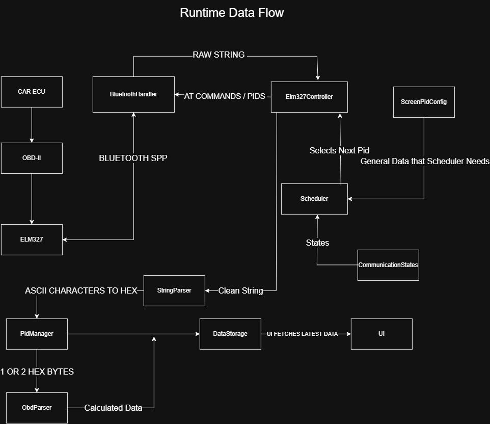
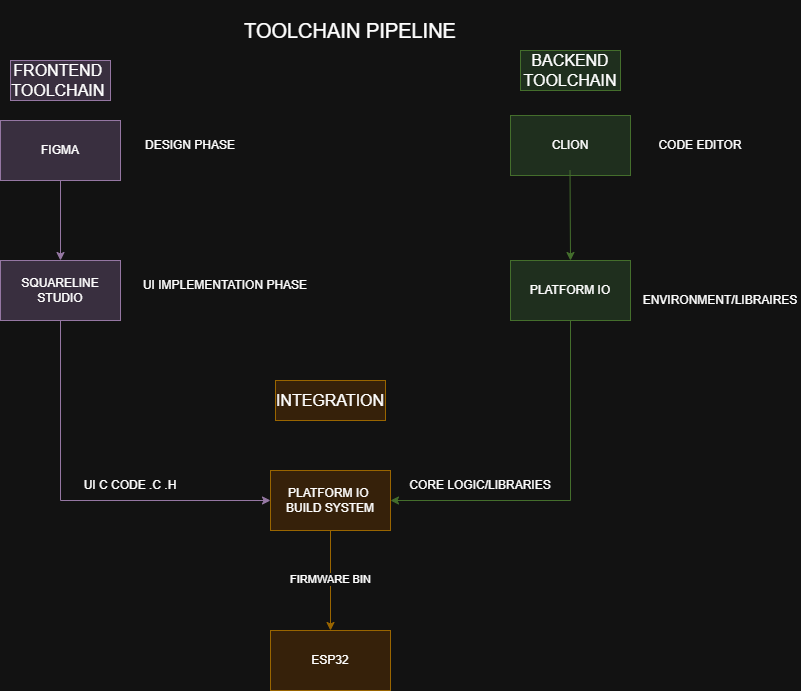

# OBD-AUTOMOTIVE-DISPLAY
An ESP32-based real-time automotive dashboard that communicates with an ELM327 adapter over Bluetooth.

## 1. Features

---
- Real-time OBD-II data
- Non-Blocking Scheduler
- Weighted Round Robin polling
- LVGL graphical Interface
- Unit Tests
- Integration Tests
- Automatic Reconnect
- Timeout Recovery

## 2. Project Architecture 

---
### 2.1. Data Flow Architecture

---
<center>
  
</center>

#### BluetoothHandler
BluetoothHandler is responsible for Bluetooth Serial Port Profile connection.
<br>It manages connection transmission and reception of raw character streams from the Elm327 adapter
#### Elm327Controller
Elm327Controller translates tasks(Pid or AT setup commands) into valid ASCII requests that start with "01"
(eg Pid=0C->request=`'010C\r'`).<br>It has a non-blocking `getReply()` that continuously reads an incoming serial stream and strips out
(`' '`,`'\r'`,`'\n'` ) and stops when it receives (`'>'`)
#### Scheduler
Scheduler acts as a non-blocking State machine that controls all the communication flow (connecting, sending requests, waiting for replies, parsing responses,error recovery...)
without blocking  the main loop of Esp32.

It supports multiple task lists, weighted round-robin scheduling, and time-based scheduling.
#### CommunicationStates
Defines all communication states used by the Scheduler <br>
(CONNECTING, IDLE, SEND_REQUEST, WAIT_REPLY, PARSE_REPLY, ERROR, DISCONNECTED).

The states are in a dedicated header to improve readability and debugging
#### ScreenPidConfig
Defines the OBD-II Pids displayed on each screen together with their refresh interval and scheduling priority
<br>Defines the AT commands needed for Elm327 initialization

The scheduler uses these tasks to determine which request should be sent and when.
#### StringParser
StringParser receives a cleaned String (e.g. 410C1A2B) and converts every pair of ASCII characters into hexadecimal bytes.

If the response (String) Starts With 41 it accepts it and calls PidManager

StringParser safely handles invalid input, `nullptr`,and empty strings
#### PidManager
PidManager receives a filtered PID response consisting of one PID byte followed by one or two data bytes.


Based on the Pid it decides which ObdParser method is used ,and stores the calculated data in DataStorage. 

#### ObdParser
ObdParser converts raw OBD-II hexadecimal values into engineering units
such as RPM, km/h, °C, %, volts, and kPa according to the official OBD-II formulas.
#### DataStorage
DataStorage stores the latest decoded values.

It serves as a shared layer between the communication pipeline and UI ,allowing the UI to display the most recent data without directly accessing the communication modules

### 2.2 ToolChain Pipeline

---
<center>
  
</center>
This project was developed with a dual-phase development toolchain to ensure a clean separation between the frontend UI and the backend logic:

* **Frontend toolchain (UI Design):** UI designing begins in **Figma** for layout and user experience planing.The designs are then imported into **SquareLine Studio**,witch automatically generates the underlying LVGL C/C++ frontend code. 
* **Backend Toolchain (Core Logic):** The core firmware,state machines,and communication pipelines were developed using **CLion** as the primary code editor.
* **Integration & Build System:** Both the generated UI code and the code logic libraries are brought together in **PlatformIO**.It acts as the central build system and environment manager,compiling the final firmware binary that is flashed onto the Esp32  

## 3. OBD-II Pids & Formulas

---
###  Standard Formulas
| DESCRIPTION                | PID  | CONVERT       | VALUE  | COMMAND TOWARDS ELM327 | REFRESH RATE MS | PRIORITY|
|:---------------------------|:----:|:--------------|:-------|:----------------------:|:----------------|:--------|
| `RPM`                      | `0C` | `(A*256+B)/4`   | `RPM`  |        `01 0C`         | `80 `           | `HIGH`  |            
| `SPEED`                    | `0D` | `A`             | `km/h` |        `01 0D`         | `80`            | `HIGH`   |
| `TEMPERATURE`              | `05` | `A-40`          | `°C`   |        `01 05`         | `1000`           |`LOW`|
| `ENGINE LOAD`              | `04` | `(A/255)*100`   | `%`    |        `01 04`         |`100`|`HIGH`|
| `IGNITION TIMING`          | `0E` | `(A/2)-64`      | `°`    |        `01 0E`         |`300`|`MEDIUM`|
| `MAF FLOW RATE`            | `10` | `(A*256+B)/100` | `g/s`  |        `01 10`         |`200`|`MEDIUM`|
| `THROTLE POS`              | `11` | `(A/255)*100`   | `%`    |            `01 11`     |`100`|`HIGH`|
| `INTAKE AIR TEMP`          |`0F`|`A-40`| `°C`   |`01 0F`|`1000`|`LOW`|
| `MAP SENSOR`               |`OB`|`A`| `kPA`  |`01 0B`|`200`|`MEDIUM`|
| `MODULE VOLTAGE`           |`42`|`(A*256+B)/1000`| `V`    |`01 42`|`1000`|`LOW`|
| `SHORT FUEL TRIM`          | `06`| `(A/1.28)-100`| `%`    |`01 06`|`1000`|`LOW`|
| `LONG FUEL TRIM`           |`07`|`(A/1.28)-100`| `%`    |`01 07`|`1000`|`LOW`|
| `DISTANCE WITH MALFUNCTION`|`21`|`A*256+B`| `KM`   |`01 21`|`5000`|`STATIC`|
| `CATALYST TEMP`            |`3C`|`((A*256+B)/10)-40`| `°C`   |`01 3C`|`5000`|`STATIC`|
| `BAROMETRIC PRES`          | `33`|`A`| `kPA`  |`01 33`|`5000`|`STATIC`|
| `ENGINE RUN TIME`          | `1F`|`A*256+B`| `sec`  |`01 1F`|`5000`|`STATIC`|


## 4. Scheduler Design & Screen Task Lists

---

Instead of polling all sensors continuously, the scheduler uses **Dynamic Task Lists** based on the active UI screen to optimize Bluetooth bandwidth.

> **Memory Optimization Note:** The scheduling structures (`Task` and `TaskList`) are heavily optimized using `constexpr` and strict types (e.g., `uint8_t`, `uint16_t`). The entire configuration resides in just **116 bytes of flash memory**.

### A. Performance Screen (Weighted Round-Robin)
Used when the driver needs high-speed updates for critical driving metrics. The scheduler utilizes a `WEIGHTED_RR` algorithm to prioritize RPM over Speed.

| DESCRIPTION | PID  | WAIT TIME | SCHEDULER WEIGHT |
|:------------|:----:|:---------:|:----------------:|
| `RPM`       | `0C` | `125 ms`  | **3**            |
| `SPEED`     | `0D` | `125 ms`  | **1**            |

> **Cycle Analysis:** A full round-robin cycle consists of **4 requests** (3 for RPM, 1 for Speed). With a wait time of 125 ms per request, a complete loop takes **500 ms**.
> * **RPM** is polled **3 consecutive times** (at 0ms, 125ms, and 250ms), providing burst updates for highly dynamic engine metrics.
> * **Speed** is polled **1 time** at the end of the cycle (at 375ms) since vehicle speed changes more gradually.

### B. Full Data Screen (Time-Based Sequential Scheduling)
Used for displaying comprehensive vehicle diagnostics. The scheduler uses a `TIME_BASED` algorithm, parsing the entire list of all available PIDs sequentially.

| DESCRIPTION                 | PID  | REFRESH TIER | WAIT TIME |
|:----------------------------|:----:|:-------------|:----------|
| `RPM`                       | `0C` | `REF_FAST`   | `80 ms`   |
| `SPEED`                     | `0D` | `REF_FAST`   | `80 ms`   |
| `ENGINE LOAD`               | `04` | `REF_HIGH`   | `100 ms`  |
| `THROTTLE POS`              | `11` | `REF_HIGH`   | `100 ms`  |
| `MAP SENSOR`                | `0B` | `REF_MEDIUM` | `200 ms`  |
| `IGNITION TIMING`           | `0E` | `REF_MEDIUM` | `200 ms`  |
| `MAF FLOW RATE`             | `10` | `REF_MEDIUM` | `200 ms`  |
| `COOLANT TEMP`              | `05` | `REF_LOW`    | `1000 ms` |
| `SHORT FUEL TRIM`           | `06` | `REF_LOW`    | `1000 ms` |
| `LONG FUEL TRIM`            | `07` | `REF_LOW`    | `1000 ms` |
| `INTAKE AIR TEMP`           | `0F` | `REF_LOW`    | `1000 ms` |
| `MODULE VOLTAGE`            | `42` | `REF_LOW`    | `1000 ms` |
| `ENGINE RUN TIME`           | `1F` | `REF_STATIC` | `5000 ms` |
| `DISTANCE WITH MALFUNCTION` | `21` | `REF_STATIC` | `5000 ms` |
| `BAROMETRIC PRES`           | `33` | `REF_STATIC` | `5000 ms` |
| `CATALYST TEMP`             | `3C` | `REF_STATIC` | `5000 ms` |

> **Cycle Analysis:** In the current iteration, the `TIME_BASED` scheduler evaluates the wait times sequentially. The total cycle time is the exact sum of the wait times of all 16 active PIDs in the array (160ms + 200ms + 600ms + 5000ms + 20000ms). This creates a full loop of **25,960 ms (~25.9 seconds)**. While this ensures strict order and prevents Bluetooth flooding, it introduces a cumulative delay for high-priority PIDs, highlighting the need for the asynchronous polling upgrade detailed in the Future Improvements section.
### C. Essential Mixed Screen (Time-Based Sequential)
A balanced screen combining high-priority driving metrics with slowly changing engine parameters to prevent bandwidth congestion.

| DESCRIPTION         | PID  | REFRESH TIER | WAIT TIME |
|:--------------------|:----:|:-------------|:----------|
| `RPM`               | `0C` | `REF_FAST`   | `80 ms`   |
| `SPEED`             | `0D` | `REF_FAST`   | `80 ms`   |
| `COOLANT TEMP`      | `05` | `REF_LOW`    | `1000 ms` |
| `INTAKE AIR TEMP`   | `0F` | `REF_LOW`    | `1000 ms` |
| `BATTERY VOLTAGE`   | `42` | `REF_LOW`    | `1000 ms` |

> **Cycle Analysis:** Using the sequential time-based approach, the total cycle time is the sum of these 5 specific wait times (80 + 80 + 1000 + 1000 + 1000), resulting in a complete loop of **3160 ms (~3.1 seconds)**. This allows the screen to provide reliable updates without overloading the ELM327 adapter.
## 5. ELM327 Initialization

---

The initialization phase executes sequentially upon connection using a time-based scheduler to ensure the ELM327 adapter processes each command properly.

| COMMAND | ACTION          | DESCRIPTION                                        | WAIT TIME |
|:--------|:----------------|:---------------------------------------------------|:----------|
| `ATZ`   | `RESET`         | Resets ELM327 to factory settings                  | `2000 ms` |
| `ATE0`  | `ECHO OFF`      | Stops ELM327 from retransmitting the command sent  | `500 ms`  |
| `ATH0`  | `HEADERS OFF`   | Hides CAN-BUS IDs -> provides clean payload        | `500 ms`  |
| `ATSP0` | `AUTO PROTOCOL` | ELM327 automatically detects car protocol          | `500 ms`  |
| `ATL1`  | `LINEFEEDS ON`  | Adds newlines to help with parsing                 | `500 ms`  |

## 6. WIRING DIAGRAM

---
| DISPLAY PIN | PIN ESP32 (DEVKIT V1)  |USAGE|
|:------------|:-----------------------|:---:|
| **VCC**     | `3V3`                    | POWER 3.3V|
| **GND**     | `GND`                    |GROUND |
| **CS**      | `ESP5`                   |CHIP SELECT|
| **RESET**   | `ESP4`                   |RESET|
| **DC**      | `ESP2`                   |DATA/COMMAND|
| **MOSI**    | `ESP23`                |SPI DATA|
| **SCK**     | `ESP18`                |SPI CLOCK|
| **LED**     | `3V3`                  |BACKLIGHT|

>**Note** Connections between the display and the Esp32 were made using Female-to-Male jumper wires
## 7. Unit Tests

---
To ensure the reliability of the core system without requiring a physical connection to a vehicle, comprehensive unit tests have been implemented.

The project uses isolated test environments to test each component independently by excluding hardware-specific dependencies (such as Bluetooth and LVGL UI).

### Test Environments
The following modules are covered by dedicated unit test environments:
* **StringParser** (`test_string_parser`): Validates the conversion of raw ASCII responses to hex bytes, handling invalid inputs correctly.
* **ObdParser** (`test_obd_parser`): Verifies the mathematical accuracy of the OBD-II formulas for all existing PIDs.
* **PidManager** (`test_pid_manager`): Ensures that PidManager works as intended and stores correctly on DataStorage.
* **Scheduler** (`test_scheduler`): Tests the non-blocking state machine,task prioritization,and timeout handling.
* **Elm327Controller** (`test_elm_controller`): Validates AT command formatting, PID requests, and response buffering logic.

### How to Run the Tests

You can run the tests locally via the PlatformIO CLI. To execute a specific test suite, use the `-e` flag followed by the environment name:

```bash
pio test -e test_string_parser
pio test -e test_obd_parser
pio test -e test_pid_manager
pio test -e test_scheduler
pio test -e test_elm_controller
```
## 8. Integration Tests

---
While Unit Tests verify individual components in isolation,the **Integration Test** environment validates the entire communication and parsing pipeline.

By running the integration tests,we simulate a complete data flow loop without needing a physical connection to the car or the display:
1. A mock Bluetooth response (e.g `41 0c 1A 2B`) is injected into the `Elm327Controller`.
2. The `Scheduler` triggers the parsing sequence.
3. The `StringParser` converts the raw ASCII string into hexadecimal bytes.
4. The `PidManager` routes the bytes to the correct mathematical formula in the `ObdParser`.
5. Finally, the test assert that the correct engineering value (e.g ,Engine Rpm) was successfully calculated and saved into the `DataStorage`.

**Run via PlatformIO CLI:**
```bash
pio test -e integration_test
```
## 9. Future Improvements

---
* **True Asynchronous Time-Based Scheduling:** 
  Upgrade the `TIME_BASED` scheduler algorithm from sequential to fully asynchronous polling. By tracking the `lastExecutedTime` per PID (rather than globally), the scheduler will be able to skip metrics that are not yet due (e.g., Engine Temp waiting for its 1000ms window) and instantly request high-priority data (like RPM or Speed). This will maximize Bluetooth bandwidth efficiency without breaking the single-request limits of the ELM327.
  
* **Dynamic Bluetooth Reconnection:**
  Implement a more robust background scanning mechanism to automatically recover dropped Bluetooth SPP connections seamlessly, without requiring a UI freeze or manual restart.

* **UI Theme Customization:**
  Expand the LVGL front-end to support dynamic color themes (e.g., Day/Night modes) matching the car's interior dashboard illumination.
* **IoT Cloud Telemetry (MQTT Integration):**
    Transition the dashboard into a fully connected Edge device. Implement an MQTT client on the ESP32 to serialize telemetry data (RPM, Speed, Engine Load) into JSON payloads and publish them to a cloud broker (e.g., AWS IoT or ThingsBoard) via a smartphone Wi-Fi hotspot. This will enable remote vehicle tracking and post-trip data analysis.