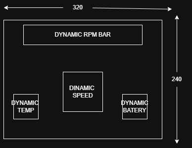

# OBD-AUTOMOTIVE-DISPLAY

## OBD Parser
###  Standard Formulas
| **DESCRIPTION** | PID  | CONVERT       |VALUE| COMMAND TOWARDS ELM327 |
|:----------------|:----:|:--------------|:---|:----------------------:|
| `RPM`             | `0C` | `(A*256+B)/4`   |`RPM`|        `01 0C`         |
| `SPEED`           | `0D` | `A`             |`kh/h`|        `01 0D`         |
| `TEMPERATURE`     | `05` | `A-40`          |`°C`|        `01 05`         |
| `ENGINE LOAD`     | `04` | `(A/255)*100`   |`%`|        `01 04`         |
| `IGNITION TIMING` | `0E` | `(A/2)-64`      |`°`|        `01 0E`         |
| `MAF FLOW RATE`   | `10` | `(A*256+B)/100` |`g/s`|        `01 10`         |
| `THROTLE POS`     | `11` | `(A/255)*100`   |`%`|            `01 11`     |

### ELM327 INITIALIZATION
|COMMAND|ACTION| DESCRIPTION                                            | DELAY         |
|:---|:---|:-------------------------------------------------------|:--------------|
 |`ATZ`| `RESET` | `RESETS ELM327 TO FACTORY SETTINGS`                    | `1000MS-1500MS`|
 |`ATE0`|`ECHO OFF`| `STOPS ELM327 FROM RETRANSMITING THE COMMAND YOU SENT` | `50MS-100MS`  |
|`ATH0`|`HEADERS OFF`| `HIDES CAN-BUS IDS=> WE GET CLEAR PAYLOAD`             | `50MS-100MS`  |
|`ATSP0`|`AUTO PROTOCOL`| `ELM327 AUTOMATICALY FINDS CAR PROTOCOL`               | `100MS-200MS` |
|`ATL1`|`LINEFEEDS ON`| `ADDS NEWLINE TO HELP WITH PARSING`                    | `50MS-100MS`    |

### REQUEST FREQUENCY
| DESCRIPTION                                                              | PID | RATE    |
|:-------------------------------------------------------------------------|:----|:--------|
                      | `RPM`                                                                    | `0C`  | `8Hz`   |
| `SPEED`                                                                  | `0D`  | `8Hz`   |
| `THROTLE`                                                                | `11`  | `2Hz`   |
| `ENGINE LOAD`                                                            | `04`  | `1HZ`   |
| `COOLANT TEMPERATURE`                                                    | `05`  | `0.5HZ` |
| `MAF FLOW RATE`                                                          | `10`  | `2HZ`   |
| `IGNITION TIMING`                                                        | `11`  | `2HZ`   |
| <tr><td colspan="2" align="left">**TOTAL**</td><td>**23.5 Hz**</td></tr> |

So we have 23.5 request/second =>every 43ms a cycle must be completed
