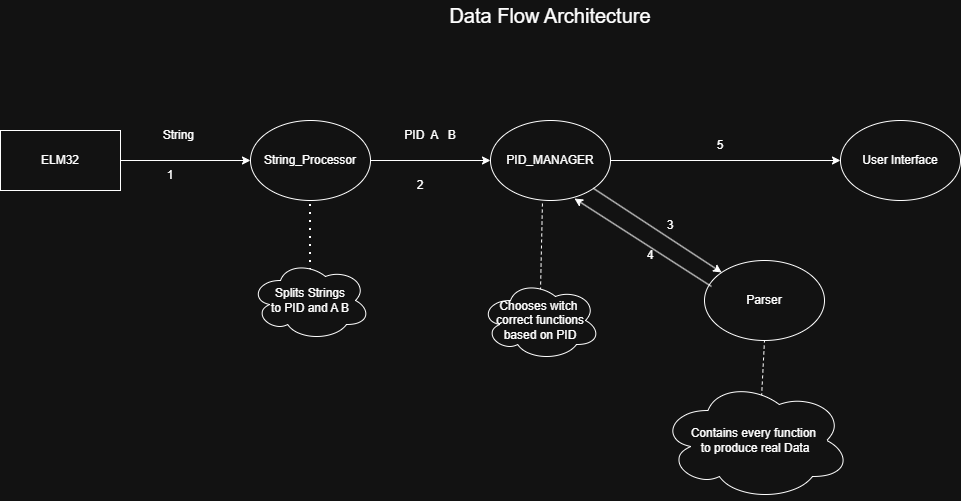

# OBD-AUTOMOTIVE-DISPLAY

## OBD Parser
###  Standard Formulas
| DESCRIPTION | PID | CONVERT       |VALUE|
|:---|:---:|:--------------|:---:|
| RPM | 0C  | (A*256+B)/4   |RPM|
|SPEED | 0D  | A             |kh/h|
|TEMPERATURE| 05  | A-40          |°C|
|ENGINE LOAD | 04  | (A/255)*100   |%|
|IGNITION TIMING| 0E  | (A/2)-64      |°|
|MAF FLOW RATE | 10  | (A*256+B)/100 |g/s|
|THROTLE POS | 11  | (A/255)*100   |%|
